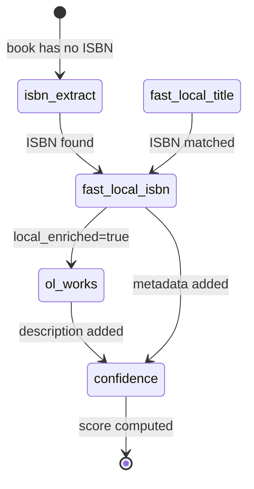

# Scheduler

## Overview

16 asyncio tasks running forever inside the main FastAPI process. Each is wrapped in `_supervised()` which catches all exceptions, logs them, sleeps for the loop's interval, then retries.

There is no task queue. No Redis. No Celery. Books needing work are found via SQL queries on each tick. `FOR UPDATE SKIP LOCKED` prevents two loops from grabbing the same book.

## Current Status (2026-06-06)

| Loop | Interval | Status | Throughput |
|------|----------|--------|------------|
| watcher | 10s | ✅ Idle | No files in incoming |
| enrichment | 10s | ⚠️ Timeouts | External APIs banned/rate-limited; AIMD backs off |
| google_books | 20s | ⚠️ Backed off | 429s from Google; AIMD handles retry |
| covers | 5s | ✅ Working | Fills gaps for ISBN'd books |
| title_cleanup | 90s | ✅ Working | Filename ISBN + genre classification |
| ocr | 120s | ❌ Dead | Intello unreachable (env var empty) |
| fast_local_isbn | 2s | ✅ Working | 5-14 per tick (feeds from isbn_extract + title match) |
| fast_local_title | 5s | ✅ Working | 26/50 matches per batch |
| isbn_extract | thread | ✅ Working | Dedicated thread, ~4-10 books/min, 17% hit rate |
| ol_works | 3s | ✅ Working | 3-6 descriptions per batch of 10 |
| text_profiler | 10s | ⚠️ Intermittent | statement_timeout sometimes |
| ocr_copyright | 15s | ✅ Stub | Returns 0 (module not implemented) |
| cover_phash | 30s | ✅ Stub | Returns 0 (module not implemented) |
| format_stack | 300s | ❓ Silent | Runs every 5 min |
| validation | 30s | ✅ Working | 1-3 books per tick |
| incipit_match | 600s | ✅ Stub | Returns 0 (module not implemented) |
| confidence | 60s | ✅ Fixed | 50 books per tick |

**Net useful work (2026-06-06):** ~865 new ISBNs/day, ~420 descriptions/hour (after ol_works fix), ~2000 confidence scores/day.

## Supervision Model

```python
async def _supervised(name: str, fn: Any, interval: int) -> None:
    await asyncio.sleep(15 + hash(name) % 30)  # stagger startup 15-45s
    while True:
        try:
            await fn()
        except Exception as e:
            log.warning(f"{name}_error", error=str(e))
        await asyncio.sleep(interval)
```

Properties:
- Loops never die permanently
- Exceptions are swallowed and logged
- Staggered startup prevents thundering herd on boot
- Each loop runs once, then sleeps `interval` seconds
- No backoff on repeated failures (retries at same interval)
- Heavy I/O tasks (isbn_extract) run in a dedicated thread with their own DB connection, started once via `_supervised` with a high interval

## Loop-by-Loop Details

### 1. Watcher (10s)

Scans `/data/incoming` for new files. Groups multi-file audiobooks. Imports stable files (2s size-stability check). Idle when incoming is empty.

### 2. Enrichment (10s) — Rate-limited

The main API enrichment loop:
1. Finds 10 candidates (`quality_score < 95`, ordered by least attempts + oldest retry)
2. Locks up to 6 via `FOR UPDATE SKIP LOCKED`
3. Calls `enrich_book(id)` with 20s timeout for each (parallel via `asyncio.gather`)
4. Post-processes: cover download, writeback, organize
5. Deep enrich for books still below quality 50

**Current state:** External APIs (OL, Google) are rate-limited/banned. The AIMD rate limiter backs off automatically and will retry when bans lift. All 6 books timeout every tick (20s per book).

### 3. Google Books (20s) — Backed off

Dedicated Google Books loop with API key. Uses AIMD rate limiter. Currently backed off due to 429 responses. Will auto-retry when backoff expires.

### 4. Covers (5s) — Working

Fetches missing covers via Apple → Bookcover API → OL chain for books that have ISBN but no cover.

### 5. Title Cleanup (90s) — Working

Three-phase:
1. Extracts ISBNs from filenames
2. Classifies genres via Google Books categories (rate-limited)
3. Detects series from titles

### 6. OCR (120s) — Dead

Submits scanned PDFs to Intello OCR. Disabled (BRAINYCAT_INTELLO_URL is empty to avoid 15s timeouts).

### 7. Fast Local ISBN (2s) — WORKING ✅

Looks up books by ISBN in the local SQLite `isbn_lookup.db` (30M records from OL dump). Writes: publisher, subjects, pubdate, cover_url, work_key.

**Self-feeding:** As `isbn_extract` and `fast_local_title` discover new ISBNs, this loop immediately enriches them. Processes 5-14 per tick.

### 8. Fast Local Title (5s) — WORKING ✅

Fuzzy title matching against local SQLite for books without ISBN. Three-tier matching:

| Tier | Method | Confidence |
|------|--------|-----------|
| 1 | Exact normalized prefix (first 4 words) | 80% |
| 2 | Word-subset overlap ≥50% | 60% |
| 3 | Trigram similarity >0.5 | 40% |

When matched, assigns the ISBN found in the dump, enabling Tier 1 ISBN pass on next tick. Finding 26/50 matches per batch.

### 9. ISBN Extract (5s) — NEW, WORKING ✅

**Added 2026-06-05. Rewritten as dedicated thread 2026-06-06.**

Runs in its own thread with its own psycopg2 connection — completely independent of the asyncio event loop. Picks one book at a time, extracts ISBN using 6 methods, writes result, moves to the next. No artificial pacing — fast EPUBs process in <1s, large PDFs take 10-30s naturally.

Extraction methods (in order):
1. **OPF metadata** — Dublin Core identifiers in EPUB's content.opf
2. **PDF metadata** — Subject/Keywords/Comments fields in DocInfo dict
3. **Filename patterns** — `9781491950395_Title.pdf`, `Title [ISBN].epub`
4. **Full-text scan** — regex with multilingual anchors, contextual type detection (ebook/pdf/print/audio)
5. **Barcode decode** — EAN-13 barcodes in page images (pyzbar)
6. **OCR last page** — tesseract on copyright page renders

**Design:** The `_supervised` wrapper starts the thread once (3600s interval = never re-triggers). The thread holds its own DB connection and loops forever, sleeping only when the candidate pool is empty (60s) or on error (10s).

Hit rate: ~17%. Throughput: ~4-10 books/min depending on file size.

**Why a thread:** File I/O (zipfile, fitz/PyMuPDF) is synchronous and blocks the event loop for 1-30s per book. A dedicated thread isolates this completely — the asyncio event loop stays free for ol_works, confidence, and other lightweight loops.

### 10. OL Works (3s) — NEW, WORKING ✅

**Added 2026-06-05.** Fetches descriptions + ratings from Open Library Works API for books that already have a local hit.

Strategy:
1. Find books with `local_enriched=true`, no description, and ISBN
2. Look up `work_key` from local SQLite (94% have one)
3. Direct GET to `https://openlibrary.org/works/{key}.json` (no search)
4. Also fetches `/works/{key}/ratings.json`
5. Stores description, subjects (as tags), and rating

**Why this works:** Direct key lookup is one precise GET per book — no search, minimal rate-limit impact. Respects AIMD rate limiter for OL.

Marks books with `extra_metadata.ol_works_tried`. Throughput: ~3-6 descriptions per batch of 10 (not all works have descriptions).

### 11. Text Profiler (10s) — Intermittent

Extracts incipit (opening text), characteristic words, winnowed fingerprint, and TF-IDF embedding from book files. Single-pass read. Uses checkpoint for resumption.

Sometimes killed by `statement_timeout` on candidate query.

### 12. OCR Copyright (15s) — Stub

Returns `{"processed": 0, "isbn_found": 0}`. Module not yet implemented (requires Intello or local tesseract pipeline at scale).

### 13. Cover pHash (30s) — Stub

Returns `{"computed": 0}`. Module not yet implemented (requires imagehash dependency).

### 14. Format Stack (300s) — Silent

Auto-stack detection, series detection, dedup merging, FTS indexing, email import. Runs every 5 minutes.

### 15. Validation (30s) — Working

Cross-checks enrichment metadata vs actual book content (title in text? author in front matter? language match?). Processes 1-3 books per tick, flags mismatches.

### 16. Incipit Match (600s) — Stub

Returns `{"groups": 0, "isbn_propagated": 0}`. Module not yet implemented. Will group books by opening-text fingerprint for ISBN propagation.

### 17. Confidence (60s) — Fixed ✅

Computes 7-signal confidence scores (100 pts max). Processes 50 books per tick.

**Bug fixed 2026-06-05:** `'bool' object has no attribute 'get'` — 13,209 books had `extra_metadata.local_title_tried = true` (boolean) instead of a dict. Fixed by adding `isinstance(local_title, dict)` guard in Signal 6 (incipit match).

## The Self-Feeding Pipeline



Books flow through the pipeline automatically:
1. `isbn_extract` scans file content → finds ISBN
2. `fast_local_isbn` enriches from SQLite → adds publisher, subjects, work_key
3. `fast_local_title` matches titles → assigns ISBN → feeds back to step 2
4. `ol_works` fetches description using work_key
5. `confidence` scores the result

## Row Locking Pattern

```sql
-- Phase 1: find candidates (no lock, may be stale)
SELECT id FROM books WHERE quality_score < 95 LIMIT 10;

-- Phase 2: lock individual candidates
SELECT * FROM books WHERE id = $1 FOR UPDATE SKIP LOCKED;
-- Returns NULL if already locked → skip
```

Why two phases: PostgreSQL doesn't allow `FOR UPDATE` with aggregates or complex ORDER BY on non-indexed expressions.

## Statement Timeout

PostgreSQL's `statement_timeout` (30s) kills some loops on startup burst. Indexes added 2026-06-05:

```sql
CREATE INDEX idx_books_no_isbn ON books(id) WHERE isbn IS NULL OR isbn = '';
CREATE INDEX idx_bookfiles_format ON book_files(book_id) WHERE format IN ('epub','pdf','mobi','azw3');
CREATE INDEX idx_books_ol_works ON books(quality_score) WHERE extra_metadata->>'local_enriched' = 'true'
  AND (description IS NULL OR description = '') AND NOT (extra_metadata ? 'ol_works_tried');
```

Remaining timeouts are intermittent and self-recover on next tick.

## Event Loop Starvation (SOLVED)

**Problem (identified 2026-06-06):** The `isbn_extract` loop used sync file I/O (zipfile, fitz/PyMuPDF) which blocked the entire asyncio event loop for 3-30s per book. This starved `ol_works` and other coroutines.

**Solution:** Moved ISBN extraction to a dedicated daemon thread with its own psycopg2 DB connection. The thread runs independently — no interaction with the asyncio event loop at all. Other loops (ol_works, confidence, fast_local) now run unimpeded.
