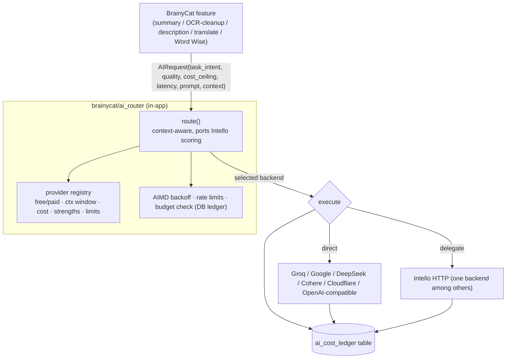

# BrainyCat Roadmap — In-App AI & LLM Routing (reduce/replace Intello dependency)

> Planning document. No code changes. Part of the roadmap program alongside
> [`master-improvement-plan.md`](./master-improvement-plan.md),
> [`library-vision.md`](./library-vision.md), [`dedup-overhaul.md`](./dedup-overhaul.md).
>
> Investigated `../intello/` and `../ai_use/` on 2026-09-30 to ground this plan.

## Problem Statement

BrainyCat's AI features (summaries, OCR, TTS/STT, Word Wise/X-Ray, genre classification, translation)
currently depend on a **remote Intello** service reached over HTTP (`intello_url` / `intello_api_key`).
The user's observation: Intello's LLM routing does not do particularly well at picking the best and
cheapest model **because it is so removed from the business** — it classifies prompts with generic
keyword heuristics and has no knowledge of the *calling context* (that a given request is a
book-description enrichment vs a chapter summary vs OCR-cleanup vs a translation). This plan proposes
bringing the routing decision (and optionally the model calls) **in-app**, where the caller already
knows the task, the acceptable cost, and the quality bar.

## Investigation findings (2026-09-30)

### `../intello/` — a capable but context-blind gateway
Intello is a real AI gateway. Its routing core (`intello/router.py`, `models.py`, `costs.py`,
`aimd.py`, `ratelimit.py`, `memory.py`, `backends.py`) already implements:

- **Task classification** (`classify_task`) via keyword signals → `code / math / creative / analysis
  / vision / long_context / general`.
- **Provider model** (`LLMProvider`): tier (free/paid), context window, per-1k input/output cost,
  strengths, daily limit, env key, availability.
- **Scoring** (`_score`): task-strength match, free-tier bonus, hard context-window exclusion, cost
  penalty, interactive-vs-background lanes (reward Groq for speed / Cloudflare for batch quota),
  task-specific model preferences, rate-limit awareness, AIMD backoff hard-exclude, and a
  cross-session learning bonus (`memory.get_score_bonus`).
- **Plan building** (`build_plan`): free-first, ranked primary + fallbacks, degraded mode, missing-key
  reporting, cost estimate, human-readable reasoning.
- **Cost ledger + budgets** (`costs.py`): per-service/provider/project/user spend, daily/monthly/total
  budget enforcement.

**The gap:** `classify_task` sees only the raw prompt text. A BrainyCat "clean up this OCR'd copyright
page and extract the ISBN" call and a "write a 3-paragraph book description" call may both classify as
`general` or `analysis` by keywords, so routing can't honor the very different quality/cost/latency
needs the *caller* already knows. Routing lives one HTTP hop away from the only place that has the
context.

### `../ai_use/` — empty
`../ai_use/` is an **empty directory** (no code). There is nothing to bring in-app from it; this plan
notes it for completeness and treats Intello's routing engine as the only existing asset to
port/adapt.

## Requirements

- **AR1 — Context-aware routing.** The caller declares the *task intent* (a small enum tied to
  BrainyCat's actual AI features), a quality tier, a cost ceiling, and a latency preference. Routing
  uses that, not just prompt keywords.
- **AR2 — In-app decision, pluggable execution.** The routing decision is made in-process. Model
  execution can either (a) call providers directly from BrainyCat, or (b) still delegate to Intello
  as one backend among others — configurable.
- **AR3 — Preserve Intello's good parts.** Port the proven mechanisms: tiered free/paid provider
  model, cost scoring, AIMD backoff, rate-limit awareness, cost ledger + budgets, cross-session
  learning. Do not reinvent them.
- **AR4 — Graceful degradation.** With no provider keys configured, AI features hide/fallback exactly
  as today (BrainyCat already degrades without Intello).
- **AR5 — Keys via local config, not code.** Provider API keys come from environment / a gitignored
  secrets file (see [Secrets](#secrets-configuration)), never committed.
- **AR6 — No regression.** Existing Intello-backed features keep working during and after migration
  (Intello remains a valid backend under AR2b).
- **AR7 — Conventions.** stdlib + `asyncpg`; the cost ledger reuses the existing DB (a table) rather
  than a second SQLite file; thread-safe; zero new heavy deps beyond an HTTP client already present.

## Proposed Solution

A small in-app module `brainycat/ai_router/` that owns the routing decision and calls providers,
with Intello demoted from "the AI service" to "one backend."

### Task-intent enum (the missing context)
A BrainyCat-specific enum, mapped to routing hints, replaces blind keyword classification:

| `task_intent` | Feature | Default quality / cost / latency |
|---|---|---|
| `book_description` | enrichment description fill | medium quality, low cost, background |
| `chapter_summary` / `goldmine` | intelligence pages / self-summary (library-vision B5 / M3) | high quality, medium cost, background |
| `ocr_cleanup` | fix OCR'd copyright/credits text | low quality, lowest cost, background |
| `genre_classify` / `bisac` | genre → BISAC/Thema | low quality, lowest cost, background |
| `translate` | book/paragraph translation | medium quality, medium cost, background |
| `word_wise` / `xray` | inline definitions / entity index (M5) | medium quality, low cost, interactive |
| `ask_book` / `recap` | companion Q&A / recap | high quality, medium cost, interactive |
| `identify` | crew/title identification reasoning | high quality, low cost, background |

The caller passes the intent; `route()` derives quality/cost/latency defaults (overridable), then
scores providers with Intello's proven `_score` logic **plus** the intent hints.

### Secrets configuration
Provider keys (`GROQ_API_KEY`, `GOOGLE_API_KEY`, `DEEPSEEK_API_KEY`, `MISTRAL_API_KEY`,
`COHERE_API_KEY`, `OPENAI_API_KEY`, `OPENROUTER_API_KEY`, `CLOUDFLARE_API_KEY` +
`CLOUDFLARE_ACCOUNT_ID`, `XAI_API_KEY`, `OLLAMA_URL`) plus BrainyCat's own config live in
environment / a **gitignored** `secrets.md` template at the repo root (documented in
[`onboarding.md`](../onboarding.md)). Keys are referenced by name; values are never committed.

## Task Breakdown

> **Owner decision (2026-09-30):** the PR #2 review recommended *extending Intello* with intent hints
> rather than porting its router. The owner chose **in-app routing** — "Intello understood as a routing
> function to select and feed LLMs; if we build it in BC, it is still there in spirit." So AI1–AI7
> proceed, with two things carried over from the review: **AI0 (consolidate all LLM call sites behind
> one `ai.complete(intent, …)`) is done first**, and a **single cost ledger lives in BrainyCat's
> Postgres with per-intent budgets** so the cross-app budget control the reviewer worried about losing
> is preserved in-app. Local-first: cloud providers are opt-in *per intent*, and full book text is
> never sent to a cloud provider unless explicitly enabled for that intent. Provider keys stay in
> `.env` / Docker secrets, not a repo-root `secrets.md`. Concrete code:
> [`decisions-and-code.md` §AI](./decisions-and-code.md#ai).

- **Task AI1 — Provider registry + config.** Port `LLMProvider` and the provider catalog into
  `brainycat/ai_router/providers.py`; read keys from config/secrets; mark availability. Tests: registry
  loads, availability reflects present keys. *(AR3, AR5)*
- **Task AI2 — Cost ledger in Postgres.** Reuse the existing DB with an `ai_cost_ledger` table + budget
  check (port `costs.py` semantics from SQLite → asyncpg). Tests: record + budget enforcement. *(AR3,
  AR7)*
- **Task AI3 — Context-aware `route()`.** Implement the task-intent enum + hint mapping, and a
  `route(AIRequest) -> RoutingDecision` that ports Intello's `_score`/`build_plan` and adds intent
  hints, AIMD backoff, rate-limit and budget guards. Pure/unit-testable. Tests: intent → sensible
  provider on a fixture catalog; budget/backoff exclusions. *(AR1, AR3)*
- **Task AI4 — Execution layer.** `execute(decision, request)` with two backends: direct
  OpenAI-compatible calls and an Intello-delegation backend. Records cost to the ledger. Tests: mocked
  provider responses; Intello delegation path; fallback on failure. *(AR2, AR6)*
- **Task AI5 — Migrate one feature end-to-end.** Route `genre_classify` (cheapest, lowest-risk) through
  the in-app router as the proof; keep Intello as a fallback backend. Compare cost/quality vs the
  current path. Tests + demo. *(AR6)*
- **Task AI6 — Migrate the rest incrementally.** Move `book_description`, `chapter_summary/goldmine`,
  `ocr_cleanup`, `translate`, `word_wise/xray`, `ask_book/recap`, `identify` one at a time, each behind
  a config flag, each with a before/after cost check. *(AR1, AR6)*
- **Task AI7 — Cross-session learning + budgets UI.** Port `memory.get_score_bonus` (learn which
  provider does each intent best) and surface the cost ledger + budgets in the admin UI. Tests + demo.
  *(AR3)*
- **Task AI8 — Decommission decision.** Once heavy features (OCR/TTS/STT) are the only remaining
  Intello calls, decide whether to keep Intello purely as the "heavy media" backend
  (`intello_heavy_url` already exists) or replace those too. Document the decision. *(AR2)*

## Open Questions

1. **How far to bring in-app?** Text LLM routing is clearly worth in-housing (the context argument).
   Heavy media (OCR/TTS/STT) may be better left to Intello's `intello_heavy_url`. Confirm the target
   boundary.
2. **Direct provider calls vs OpenRouter.** Calling providers directly maximizes cost control; routing
   everything through OpenRouter simplifies keys at a margin cost. Which default?
3. **Cost ledger location.** Reuse BrainyCat's Postgres (AR7, recommended) vs a standalone SQLite like
   Intello's `costs.db`.

## Cross-cutting

- **AR4 degradation:** with zero keys, the router returns a `degraded` decision and features hide —
  identical to today's no-Intello behavior.
- **No new heavy deps:** direct calls use the HTTP client already in the app; no SDK sprawl.
- **Security:** keys only ever come from env / gitignored secrets; never logged, never committed
  (see the Secrets note in `onboarding.md`).
