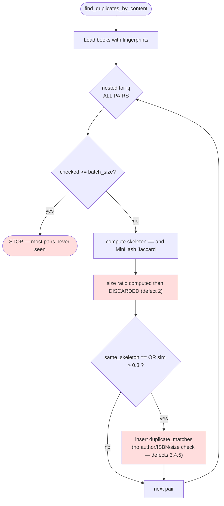
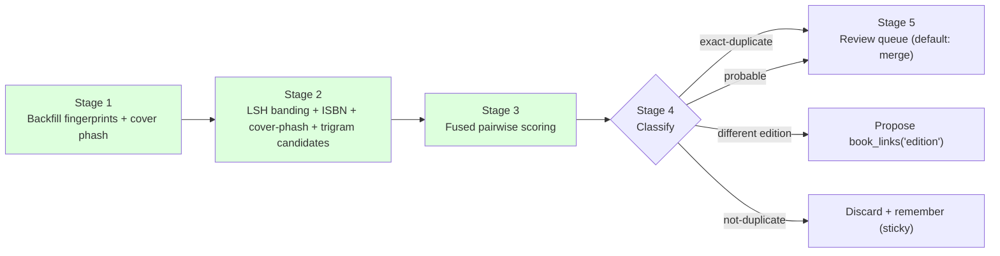
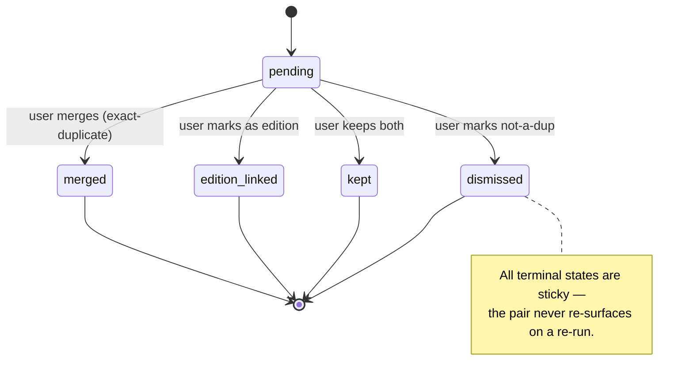

# BrainyCat Roadmap — Duplicate Detection Overhaul

> Planning document. No code changes. Companion document: [`library-vision.md`](./library-vision.md).
>
> Diagnosis verified against `brainycat/fingerprints.py`
> (`find_duplicates_by_content`, `get_duplicate_matches`, `find_exact_duplicates`) and
> `scripts/audit_dedup_coverage.py` on 2026-09-30.

## Problem Statement

The current content-duplicate detection is not reliable in production ("not very successful" in the
author's own assessment). This document diagnoses the concrete failures in the current
implementation and prescribes a **fused, scalable, review-driven** replacement.

## Current State — Diagnosed Failures

Each defect below is a real property of the current code, with its exact root cause.

1. **O(n²) all-pairs loop with no cursor, capped by `checked >= batch_size`.** `find_duplicates_by_content` compares
   every book against every other in a nested loop, but breaks once `checked` reaches `batch_size`.
   **Worse than first stated (per review §3.4):** there is *no cursor* — the list is re-sorted by
   title every call and `checked` counts outer-loop rows, so every run re-compares the *same* first
   `batch_size` books, and any pair where both books sort after that position is **never** compared
   on any run. (On the fides tree this is now called every 20 s with `batch_size=20` — re-scanning
   the same 20 books forever; fix in Phase 0.) At the real library scale
   (**~3,900 books on fides, not 63K** — that figure was unverified and is corrected here) the full set is never compared — most pairs are never examined. Despite the
   "MinHash/LSH" naming, there is **no LSH banding/blocking**: it is brute-force MinHash without the
   bucketing that is the entire point of LSH.

2. **Dead size-similarity computation.** The line computing the min/max character ratio is evaluated
   and then **thrown away** (its result is never assigned to a variable or used). Length therefore
   plays no part in the decision, so two works of wildly different length can match on a low Jaccard
   score.

3. **Loose fixed threshold (`sim > 0.3`) with no corroboration.** A 0.3 MinHash Jaccard is a loose
   bar, and it is used with no title/author corroboration. This is the primary source of the
   observed false positives.

4. **Brittle skeleton-hash equality.** The structural "skeleton" is compared with exact `==`, and a
   match floors overlap at 80. Exact equality breaks on any formatting difference between two copies
   of the same work → **false negatives** (misses true duplicates); combined with defect 3 it also
   contributes to **false positives**.

5. **No fusion of independent signals.** The decision relies on a single weak signal (text MinHash)
   instead of combining ISBN equality, cover perceptual hash, title/author similarity, and content
   fingerprint into a weighted score.

6. **Coverage gaps.** Per `scripts/audit_dedup_coverage.py`, content fingerprints and embeddings are
   far from 100% coverage, so many books cannot be compared at all. There is no backfill guarantee
   before a dedup run.

## Requirements

- **DR1 — Scale to 63K+ books.** Candidate generation must be sub-quadratic (LSH banding). No
  all-pairs comparison.
- **DR2 — Multi-signal fusion.** Combine ISBN equality, title+author similarity, content MinHash
  Jaccard, structural skeleton similarity (**fuzzy**, not `==`), size ratio, and cover perceptual
  hash into a single weighted confidence.
- **DR3 — Edition-awareness.** Distinguish "same work, different edition/format/language" from a
  "true duplicate". Different editions must **not** be auto-merged; they are **linked**
  (`book_links('edition')`) rather than flagged as duplicates.
- **DR4 — Content-type awareness.** Summaries are deduplicated only against other summaries and are
  never flagged as a duplicate of their full book. (Cross-references
  [`library-vision.md`](./library-vision.md) Task A2 / R4.)
- **DR5 — Coverage guarantee.** Backfill content fingerprints and cover perceptual hashes for all
  eligible books before/at dedup; expose coverage metrics.
- **DR6 — Human-in-the-loop review queue.** Clear actions — merge / keep-both / mark-as-edition /
  not-a-dup — and decisions are **sticky**: a resolved pair never re-surfaces.
- **DR7 — Correctness of primitives.** The crc32 fingerprint-stability fix and the bottom-k MinHash
  + `asyncio.to_thread` fix (both landed in PR #1) are the foundation; add proper LSH banding on top.
- **DR8 — Conventions.** Additive, idempotent migrations with downgrade; zero-build vanilla
  frontend; stdlib + `asyncpg` (+ Pillow for perceptual hashing); thread-safe; graceful degradation
  without Intello.

## Proposed Solution — Fused, banded, review-driven dedup

### Stage 1 — Coverage backfill (DR5)

Ensure `book_fingerprints` (content MinHash) and a new cover perceptual hash exist for all eligible
books, driven by scheduler loops, with audit metrics surfaced in the admin UI.

### Stage 2 — Candidate generation via LSH banding (DR1)

Replace the O(n²) capped loop. Split each 128-value MinHash signature into `b` bands of `r` rows;
hash each band; books that share any band-bucket are candidate pairs. Additionally generate
candidates by:

- Exact ISBN match.
- Cover-phash Hamming-distance bucket.
- Title trigram (pg_trgm) blocking.

Union the candidate sets. This is sub-quadratic — only genuinely similar items are ever scored.

### Stage 3 — Pairwise fused scoring (DR2)

For each candidate pair, compute:

- `isbn_equal` — strong signal.
- `title_author_sim` — `identify.same_title` plus author-surname overlap.
- `minhash_jaccard` — content overlap.
- `skeleton_similarity` — a **fuzzy** ratio, not exact `==`.
- `size_ratio` — the min/max character (or byte) ratio, now actually used.
- `cover_phash_similarity` — 1 − normalized Hamming distance.

Combine these into a confidence in `[0, 1]` and a class via the documented rubric below.

**Fusion rubric (weights and thresholds — each linked to a requirement).** Weights are the initial
proposal, to be tuned against the labeled fixture set in Task D4.

> **⚠️ CORRECTED after PR #2 review (see [`decisions-and-code.md` §D4](./decisions-and-code.md#d4)).**
> A fixed linear sum with `isbn_equal=0.35` **cannot flag any ISBN-less pair**: the max reachable
> score without ISBN is 0.25+0.20+0.10+0.05+0.05 = **0.65**, below the 0.70 threshold — and ISBN-less
> books are exactly the hard cases. Mandatory fixes: (1) **renormalize over the signals actually
> present** (weighted mean), so an identical-text pair with no ISBN scores ~0.99; (2) **fit the
> weights on labeled pairs** rather than hand-guessing (charter principle 4); (3) gate `isbn_equal`
> through `identify.reject_shared()` first. The weights below are only initial priors for fitting,
> and the class table is superseded by the **5-class** table in [§D5](./decisions-and-code.md#d5)
> (format ≠ edition: same-edition-different-format is **stacked**, not edition-linked; translations
> use the OL `work_key` / multilingual embeddings).

| Signal | Weight | Rationale | Requirement |
|---|---:|---|---|
| `isbn_equal` | 0.35 | Strongest identity signal when present | DR2 |
| `minhash_jaccard` | 0.25 | Core content-overlap measure | DR2, DR7 |
| `title_author_sim` | 0.20 | Corroboration the current code lacks (defect 3) | DR2 |
| `cover_phash_similarity` | 0.10 | Independent visual signal (defect 5) | DR2, DR5 |
| `skeleton_similarity` (fuzzy) | 0.05 | Structural corroboration, no longer brittle (defect 4) | DR2 |
| `size_ratio` | 0.05 | Guards against different-length false matches (defect 2) | DR2 |

| Class | Condition | Routing | Requirement |
|---|---|---|---|
| exact-duplicate | identical file hash, **or** fused confidence ≥ 0.92 | review queue, default action **merge** | DR6 |
| same-work-different-edition | high content/ISBN match **but** differing format/language/size | propose `book_links('edition')`, **not** merge | DR3 |
| probable-duplicate | 0.70 ≤ fused confidence < 0.92 | review queue | DR6 |
| not-duplicate | fused confidence < 0.70 | discard + remember (sticky) | DR6 |

### Stage 4 — Classification & routing (DR3, DR6)

- **exact-duplicate** — into the dedup review queue, default action *merge*.
- **same-work-different-edition** — propose a `book_links('edition')` link; never merge.
- **probable-duplicate** — into the review queue.
- **not-duplicate** — discard and remember, so it is not re-scored on the next run.

### Stage 5 — Review UI (DR6)

Queue grouped by candidate cluster; per-pair actions merge / keep-both / mark-as-edition /
not-a-dup. Resolved pairs never re-surface — the resolution is persisted keyed by the pair and is
resilient to re-runs.

## Task Breakdown (test-driven, incremental)

- **Task D1 — Correctness fixes in the existing scorer.** Use the currently-dead size ratio in the
  decision, and make the skeleton comparison a **fuzzy ratio** instead of exact `==`. Smallest
  change, immediate precision gain. Unit tests on synthetic pairs. Demo. *(DR2)*
- **Task D2 — Cover perceptual hashing.** Implement the `cover_phash` scheduler stub: perceptual
  hash of covers (Pillow), storage, a backfill loop, and a coverage metric. Tests. Demo. *(DR5)*
- **Task D3 — LSH banding candidate generation.** Replace the O(n²) capped loop with LSH banding
  (`b` bands of `r` rows) for candidate generation; keep MinHash Jaccard for scoring. Tests: banding
  recall vs brute-force on a fixture set; performance on a synthetic 10K set. Demo. *(DR1)*
- **Task D4 — Multi-signal fused scorer.** ISBN + title/author + MinHash + fuzzy skeleton + size +
  cover phash, with the documented weights/thresholds and a classifier. Pure and unit-tested against
  **labeled fixture pairs** (true duplicate / different edition / unrelated). Demo. *(DR2)*
- **Task D5 — Edition-vs-duplicate routing.** Different-edition candidates propose
  `book_links('edition')` instead of merge; content-type gating so summaries dedup only against
  summaries. Tests. Demo. *(DR3, DR4)*
- **Task D6 — Review queue UI + sticky resolutions.** Actions merge / keep-both / mark-as-edition /
  not-a-dup; resolved pairs never re-surface. Tests. Demo. *(DR6)*
- **Task D7 — Coverage-guarantee scheduler + audit surfacing.** Integrate the
  `scripts/audit_dedup_coverage.py` logic into an admin metric and a backfill guarantee. Tests.
  Demo. *(DR5)*
- **Task D8 — Docs/steering update.** Document the fused rubric, the weights, the LSH parameters
  (`b`, `r`), and the edition-vs-duplicate policy. *(DR8)*

## Cross-cutting

- **Reversibility.** Any schema addition (e.g. cover-phash storage, sticky-resolution table) is an
  additive, idempotent migration with a downgrade.
- **No-Intello degradation.** Cover perceptual hashing and MinHash are local (stdlib + Pillow) — no
  Intello needed for the whole dedup pipeline.
- **Performance target.** A full-library candidate pass (Stage 2) completes within a stated time
  budget on 63K+ books, precisely because candidate generation is LSH-banded rather than all-pairs.
- **Testing with labeled fixtures.** The fused scorer (D4) and edition routing (D5) are validated
  against a hand-labeled fixture set of pairs marked *true-duplicate*, *different-edition*, and
  *unrelated*.

## Relationship to PR #1

PR #1 already fixed two dedup **primitive** bugs that this overhaul depends on:

- **crc32 fingerprint stability** — replaced the builtin `hash()` (randomized per process via
  `PYTHONHASHSEED`) with `zlib.crc32`, so fingerprints computed before and after a restart live in
  the same hash space and can actually match.
- **bottom-k MinHash + `asyncio.to_thread`** — replaced an unbounded O(n·k) MinHash that blocked the
  event loop for tens of seconds with a size-capped MinHash run off the event loop.

> **Correction (review §3.3):** `_minhash` is **not** a bottom-k sketch — it truncates the input set
> to its 50,000 smallest values (`_MINHASH_MAX_INPUT`) then computes a classic **128-function k-hash
> MinHash**. Good news for D3: the signature is *positional*, so LSH banding applies to it directly
> (see [`decisions-and-code.md` §D3](./decisions-and-code.md#d3)). Caveat: truncating each book's set
> independently biases the Jaccard estimate downward when set sizes differ greatly (PDF vs EPUB of
> the same text); a true bottom-k over the union, or a higher cap, removes the bias.

This overhaul **builds on those fixes** and adds what was still missing: LSH banding (DR1),
multi-signal fusion (DR2), edition-awareness (DR3), content-type awareness (DR4), a coverage
guarantee (DR5), and a sticky human-in-the-loop review queue (DR6).
