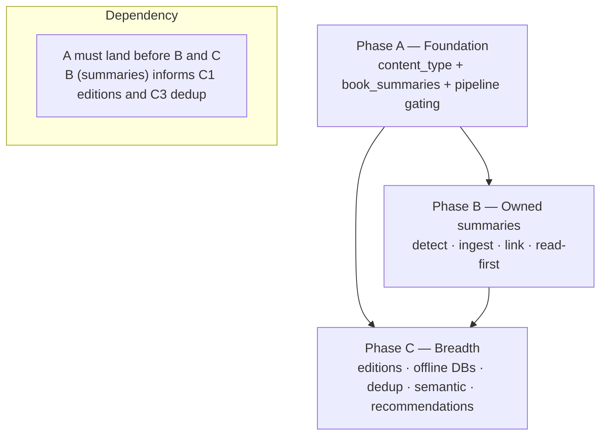
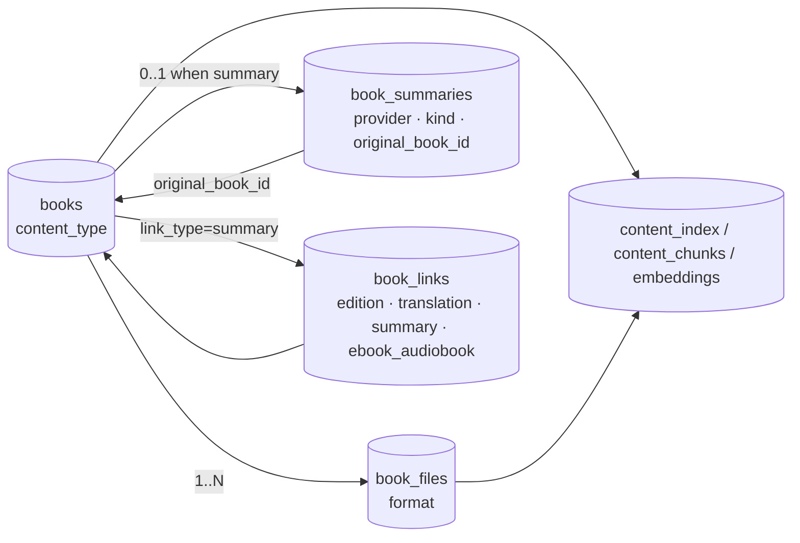
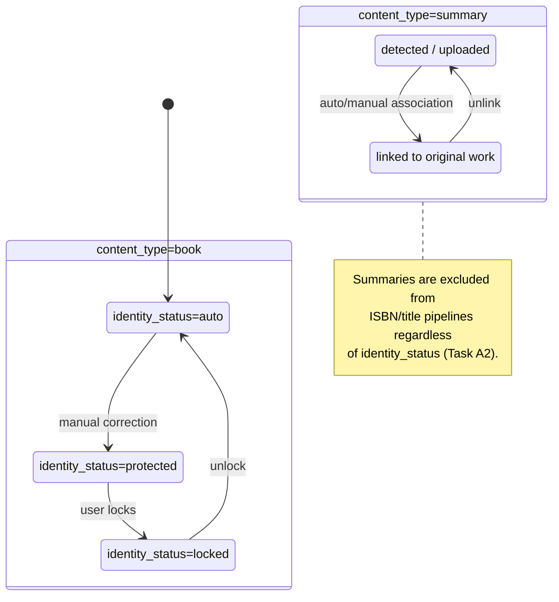

# BrainyCat Roadmap — Multi-Format / Multi-Language / Multi-Edition, Maximal Enrichment, Offline Reference DBs, and Owned Summaries

> Planning document. No code changes. Companion document: [`dedup-overhaul.md`](./dedup-overhaul.md).
>
> Verified against the codebase on 2026-09-30. Some modules this plan builds upon
> (`offline_bootstrap.py`, `ol_local.py`, `cover_phash.py`, `text_profiler.py`, and the
> `embeddings` pipeline) currently live in the author's local working tree and are **not yet in
> `main`**; where that is the case it is called out explicitly.

## Problem Statement

Evolve BrainyCat into a complete personal library that:

1. Models a logical **work** with many formats, languages, and editions cleanly.
2. Maximizes metadata enrichment across all available sources, **offline-first** wherever a source
   publishes a bulk dump.
3. Strengthens content-duplicate detection (specified in the companion document
   [`dedup-overhaul.md`](./dedup-overhaul.md)).
4. Stores the user's **owned** summaries/abstracts (getAbstract, Blinkist, self-authored, and other
   purchased summary content) as first-class **ISBN-less** items — auto-detected via provider
   boilerplate signatures from incoming/uploaded files, auto-associated with their full works, and
   surfaced as the proposed **first read** so the user can decide whether the full book is worth
   their time (and save hours by skimming the summary first).

## Requirements

Every design decision below is tagged with the requirement it satisfies.

- **R1 — Editions/formats/languages grouping.** One logical work groups its multiple files
  (formats), editions, and language variants under a single entry. Extend the existing `book_links`
  model rather than introducing a parallel structure.
- **R2 — Maximal sources.** All existing source adapters are usable; region/language routing is
  completed so the right source is tried first (French → BnF, German → DNB, and so on for every
  configured region).
- **R3 — Offline reference DBs (opt-in, dump-only).** Local reference databases are opt-in per
  source and offered **only for sources that publish a bulk dump**:
  - OpenLibrary — full editions dump (supported today).
  - BnF — SPARQL bulk extraction (supported today).
  - DNB — bulk / OAI (to add).
  - Gutendex, Standard Ebooks, Packt, Open Textbooks — small catalogs (feasible, low cost).
  - Wikidata — technically possible but **too large to be worth it** in most cases; registered but
    **disabled by default**, with an explicit size warning.
  - Google Books — **excluded**: it publishes no bulk dump and is API-only.
  A pluggable framework lets any dump-offering source be added later without bespoke code.
- **R4 — Content dedup.** Specified in [`dedup-overhaul.md`](./dedup-overhaul.md). Summaries are
  deduplicated **only against other summaries**, never against their full book.
- **R5 — Owned summaries stored ISBN-less.** Summaries are stored with no ISBN; each captures its
  provider and its kind (`key_ideas`, `chapter`, `full_text`, `audio`), an optional link to the
  full work, and is **excluded from all ISBN/title pipelines**.
- **R6 — Summary auto-detection.** Summaries arriving via the incoming folder or manual upload are
  detected from provider boilerplate signatures embedded in the file, then auto-matched to the full
  book by title/author.
- **R7 — Summary-first reading.** On a full book that has a linked summary, the summary is proposed
  as the first read; the full book is opened only on demand.
- **R8 — Conventions.** Additive, idempotent migrations with a downgrade; zero-build vanilla
  frontend; Python stdlib + `asyncpg`; thread-safe writes; graceful degradation when Intello (AI
  features) is unavailable.

## Background (verified in code, 2026-09-30)

- `books.isbn` is nullable — ISBN-less items are already storable. `books.content_type` does **not**
  yet exist.
- `book_links(link_type CHECK ('ebook_audiobook','translation','edition'))` exists. So do
  `book_translations`, `collection_books`, `content_index`, `content_chunks`, and the `embeddings`
  pipeline (currently **TF-IDF-hashed vectors stored in a `vector(384)` column, not true semantic
  embeddings**), plus `fingerprints` and the `compare_fingerprints` function added in PR #1.
- `watcher._import_file` has two extension hooks already in place: `consumption_rules.apply_rules`
  and `content_guard.detect_content_signals` (which samples text). These are the ideal insertion
  points for boilerplate detection.
- `offline_bootstrap.py` already downloads and indexes the OpenLibrary editions dump and a BnF
  SPARQL extraction into local SQLite; `fast_local.py` enriches ~1000 books/min against them.
  **This module currently lives in the author's local working tree, not yet in `main`.**
- The current highest migration is `011_translations.py`; the next migration is `012`.
- `identity_status` (introduced in PR #1) is the precedent for gating pipelines on a per-book state
  column. `content_type` follows the same discipline.

## Sequencing Strategy

Foundation first, then the highest-visibility user value, then breadth.

- **Phase A — Foundation:** content types and pipeline gating. Everything else depends on it.
- **Phase B — Owned summaries:** ingest, detect, link, read-first. Front-loads the visible payoff.
- **Phase C — Breadth:** editions grouping, offline-DB framework, dedup, semantic embeddings,
  recommendations.

---

## PHASE A — Foundation: content types & pipeline gating

### Task A1 — Migration 012: `content_type`, `book_summaries`, and the `'summary'` link type

**Satisfies:** R1, R5, R8.

- `ALTER TABLE books ADD COLUMN content_type TEXT NOT NULL DEFAULT 'book' CHECK (content_type IN ('book','summary','article','sample'))`, plus an index on `content_type`.
- Extend the `book_links` `link_type` CHECK constraint to add `'summary'` (drop and recreate the
  constraint idempotently).
- New table `book_summaries`:
  - `book_id UUID PRIMARY KEY REFERENCES books(id) ON DELETE CASCADE`
  - `provider TEXT`
  - `provider_ref TEXT`
  - `summary_kind TEXT CHECK (summary_kind IN ('key_ideas','chapter','full_text','audio'))`
  - `source_url TEXT`
  - `is_self_generated BOOLEAN DEFAULT false`
  - `original_book_id UUID NULL REFERENCES books(id) ON DELETE SET NULL`
  - `duration_seconds REAL`
  - `word_count INTEGER`
  - `acquired_at TIMESTAMPTZ`
  - `extra JSONB DEFAULT '{}'`
- **Tests:** migration up/down idempotency; CHECK accepts every valid value and rejects an invalid
  one; FK cascade (deleting the summary book removes its `book_summaries` row; deleting the original
  book sets `original_book_id` to NULL).
- **Demo:** a book can be flagged `'summary'`, linked to an original via `book_links('summary')`,
  and carries provider metadata in `book_summaries`.

### Task A2 — Gate ISBN/title/dedup pipelines on `content_type='book'`

**Satisfies:** R5, R4.

Add a guard (`AND content_type = 'book'` in the candidate `SELECT`, or an early return on the
fetched row) to **every** write path that could corrupt a summary:

1. `isbn.extract_and_store_isbn`
2. `title_cleanup.apply_local_title_parse`
3. `title_cleanup.fix_titles_from_api`
4. `title_cleanup.cleanup_titles_regex`
5. `title_cleanup.extract_isbn_from_title`
6. `title_cleanup.extract_isbn_from_filename`
7. `sentence_match._apply_match`
8. `deep_enrich.deep_enrich`
9. `fast_local.fast_local_pass`
10. `fast_local.fast_title_pass`
11. `ol_works` (its candidate query)
12. `scheduler._isbn_worker` (the ISBN-worker candidate query)
13. `fingerprints` dedup candidate query

- **Tests:** for each of the 13 call sites, a `'summary'` row is skipped (unit tests with mocked DB
  rows).
- **Demo:** run a full title-cleanup + ISBN cycle with summaries present in the library; the
  summaries are untouched.

### Task A3 — Summary-aware quality score

**Satisfies:** R5, R8.

- Branch `metadata.recompute_quality` on `content_type`. Summaries use a dedicated rubric: provider
  present, original linked, word/audio length present, cover present, description present — **not**
  the 10-field ISBN-weighted rubric used for full books.
- **Tests:** a summary is scored by the summary rubric; a book still uses the full-book rubric.
- **Demo:** a summary shows a sensible quality score instead of ~0.

---

## PHASE B — Owned summaries: ingest, detect, link, read-first

### Task B1 — `brainycat/summary_detect.py` (pure boilerplate signature detector)

**Satisfies:** R6.

- A pure module: given sampled text (first and last N pages), match known provider signatures via a
  **data-driven signature table** so a new provider is a one-line addition:
  - **getAbstract** — phrases: `"getAbstract"`, `"Take-Aways"`, and its rating/recommendation
    boilerplate.
  - **Blinkist** — phrases: `"Blinkist"`, `"blink"`, `"Final summary"`.
  - **Generic** — the pattern `"This is a summary of …"` and similar self-declared-summary phrasing.
- Returns `(provider, confidence, summary_kind, detected_title, detected_author)` where extractable.
- **Tests:** fixture tests with real boilerplate snippets classify correctly; a normal book returns
  `None`; ambiguous input returns low confidence.
- **Demo:** feeding a getAbstract PDF's sampled text yields `provider='getAbstract'` with high
  confidence.

### Task B2 — Wire detection into incoming + upload

**Satisfies:** R6, R5.

- In `watcher._import_file` (immediately after `detect_content_signals`) and in
  `books._ingest_one_file`: run `summary_detect` on sampled text. On confident detection, set
  `content_type='summary'`, create the `book_summaries` row (provider, kind, `is_self_generated=false`),
  and **suppress ISBN chasing** for that item.
- A manual override on the upload form (provider dropdown; a "self-generated" checkbox) for files
  without detectable boilerplate.
- **Tests:** dropping a Blinkist file in the incoming folder yields a summary row and **no** ISBN
  task queued; a manually flagged self-generated summary stores `is_self_generated=true`.
- **Demo:** drop a Blinkist MP3/PDF in incoming → it appears tagged as a Blinkist summary.

### Task B3 — Auto-association to the full work

**Satisfies:** R6, R1.

- After detection, match `detected_title` + `detected_author` (and the original's ISBN if present)
  against existing `books WHERE content_type='book'` using the existing `identify.same_title` /
  trigram helpers. On a confident match, write `book_links(link_type='summary')` and
  `book_summaries.original_book_id`. On a weak match, leave unlinked and add to a review queue.
- Endpoints:
  - `POST /api/v1/books/{summary_id}/link-original` (body: `original_book_id`)
  - `DELETE /api/v1/books/{summary_id}/link-original`
  - `GET /api/v1/books/{book_id}/summaries`
- **Tests:** a confident match auto-links; a weak match goes to the review queue; the reverse lookup
  returns the summary from the full book.
- **Demo:** importing a summary of a book already in the library auto-attaches it to that book.

### Task B4 — Summary-first reading experience (the payoff)

**Satisfies:** R7.

- On the full book's detail page, when a linked summary exists, show a prominent **"Read the summary
  first"** card (provider-attributed) above the "Open full book" action. For audio summaries, a
  "Listen (X min)" action.
- Reuse the existing `book_files` reader/player (PDF/EPUB/MP3) — **no new reader code**.
- A library filter/shelf `content_type=summary`; a "Summary available" badge on full books (using
  the existing genre-color-stripe visual system); a setting "Prefer summary when available."
- **Tests:** `list_books?content_type=summary` filter; the detail page includes linked summaries;
  "prefer summary" surfaces it first.
- **Demo:** open a book that has a Blinkist summary → skim the summary in-app, then decide whether to
  open the full book.

### Task B5 — Self-generated summaries (optional, Intello)

**Satisfies:** R5, R8.

- A "Generate my own summary" action: chunk the owned full book via the existing `content_chunks`,
  LLM-summarize per chapter (via Intello), store the result as a new `content_type='summary'` with
  `is_self_generated=true`, `provider='self'`, linked to the original. The action is hidden when
  Intello is unavailable.
- **Tests:** generation stores a linked self-summary; the feature is disabled cleanly with no
  Intello configured.
- **Demo:** generate a chapter-summary edition of a book you own and read it first.

### Task B6 — MCP + search integration for summaries

**Satisfies:** R6, R7.

- Extend the `search_books`, `search_content`, and `similar_books` tools to include/exclude
  summaries (exclude by default). Add `list_summaries_of` and `link_summary` MCP tools.
- **Tests:** the MCP tools return a book's summary on request and exclude summaries by default.
- **Demo:** ask the assistant "do I have a summary of &lt;book&gt;?" → it returns the linked provider
  summary.

---

## PHASE C — Breadth

### Task C1 — First-class editions/formats/language grouping

**Satisfies:** R1.

- Promote `book_links('edition')` into a UI-visible "editions" grouping on the book page (formats,
  languages, editions listed under one work). Auto-link same-ISBN / same-fingerprint files as
  editions on import.
- **Tests:** two editions of one work group correctly; an audiobook+ebook link surfaces.
- **Demo:** a work shows "EPUB · PDF · Audiobook · FR/EN editions" under one entry.

### Task C2 — Pluggable offline reference-DB framework

**Satisfies:** R3.

- Generalize `offline_bootstrap.py` into a `LocalSource` registry: each source declares
  `{name, dump_url|sparql, indexer, lookup_fn, disk_budget, enabled_env}`. Register OpenLibrary and
  BnF (existing) and add DNB. Register Wikidata **disabled by default** with a size warning. Document
  Google Books as **API-only, no local option**.
- Admin UI: per-source toggle, download/index status, re-index button, disk usage, last-updated.
- Unified local-first dispatch in `metadata.enrich_book`: try enabled local sources before the
  network.
- **Tests:** registry wiring; a mock local source downloads/indexes/looks up; a disabled source is
  skipped; the disk-budget guard triggers.
- **Demo:** toggle DNB on in Settings → German books enrich locally with no API calls.

### Task C3 — Content-duplicate detection

**Satisfies:** R4.

Specified in full in [`dedup-overhaul.md`](./dedup-overhaul.md): perceptual-cover dedup,
edition-aware fingerprint dedup, and a review queue. Summaries are excluded from full-book dedup and
deduplicated only against other summaries.

### Task C4 — True semantic embeddings upgrade

**Satisfies:** R2, R8.

- Replace the TF-IDF-hashed vectors with real embeddings (an Intello embedding endpoint or a local
  sentence-transformer), keeping the existing `vector(384)` / pgvector columns and the `find_similar`
  query. Backfill via `reindex_all`. Fall back to the current TF-IDF vectors when Intello is
  unavailable.
- **Tests:** embedding dimension/storage; similarity ranks a known-related pair above an unrelated
  one; graceful fallback with no Intello.
- **Demo:** "find books about X" and improved recommendations, including across summaries.

### Task C5 — Complete the 7-category recommendation dispatch

**Satisfies:** R2.

- Implement real per-category logic behind `reco_category` (DNA, Author, Community, Hidden-Gems,
  Series, Anti, NLP-themes) using taste profiles + embeddings, replacing the current
  same-list-for-every-category behavior.
- **Tests:** each category returns distinct, sensible results.
- **Demo:** the discovery page categories differ meaningfully.

### Task C6 — Docs, steering, and roadmap update

**Satisfies:** R8.

- Document `content_type`, `book_summaries`, boilerplate detection, the "summaries never chase ISBN"
  gate, the offline-source registry, and the "Google Books has no dump / Wikidata is
  optional-and-large" decisions in devdocs + the steering file — the same discipline as PR #1's
  `original_filename` note.
- **Demo:** a new contributor can add a summary provider signature or a new offline source by
  following the docs.

---

## Cross-cutting notes

- **Legality.** Only the user's **owned** summaries are ingested; commercial-provider content the
  user purchased or subscribed to is stored for personal use with the provider always attributed.
  No scraping of paywalled content. The Phase C offline dumps are all officially published datasets.
- **Reversibility.** Every schema change is an additive, idempotent migration with a downgrade.
- **No-Intello degradation.** Tasks B5 and C4 hide or fall back cleanly when Intello is absent.
- **Testing discipline.** Each task ships unit tests; detection (B1) gets fixture-based tests using
  real boilerplate samples.

## Data model — component interaction

## State — `content_type` × `identity_status`

