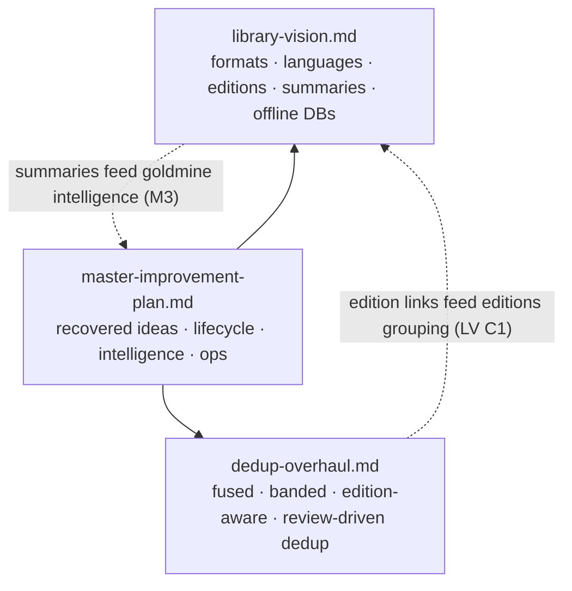

# BrainyCat Roadmap — Master Improvement Plan

> Planning document. No code changes. Companions:
> [`library-vision.md`](./library-vision.md), [`dedup-overhaul.md`](./dedup-overhaul.md).
>
> This is the umbrella plan. It (1) recovers ideas that were scoped in earlier docs but slipped off
> the active table, (2) consolidates them with the vision and dedup plans, and (3) gives concrete,
> assessable technical steps and sequencing. Verified against the codebase and all `docs/` +
> `devdocs/` on 2026-09-30.

## How this plan was built

The existing documentation set was read end to end to make sure nothing that was once scoped has
been silently dropped:

- `docs/roadmap.md` (v1.1 → v3.0 tables + Ideas Parking Lot + Testing Plan)
- `docs/v2-requirements.md` (R2.1 → R2.11, priority matrix)
- `docs/honest-status.md` (what works / known issues / architecture decisions)
- `docs/user-journeys.md` (UJ-01 → UJ-33)
- `docs/features.md`, `docs/launch-plan.md`, `docs/selfhosted-post.md`,
  `docs/koreader-rfe-kosync-queue.md`, `docs/RELEASE_NOTES.md`
- `devdocs/` (architecture, data-model, enrichment-pipeline, scheduler, confidence, isbn-intelligence,
  reader, catalog-discovery, mcp-server, deployment, runbook, bugs)

## Recovered ideas — scoped before, not on the active table

Each item below was already specified in an earlier doc, is still valuable, and is explicitly
re-surfaced here so it is not lost. Grouped by theme, tagged with its origin.

### Identity, status, and lifecycle
- **`processing_status` / scan-failed flag** (v2-req R2.11.8) — a proper `pending / processing /
  complete / failed` column so a book that fails OCR/extraction is shown in admin with its error
  reason and is **not retried forever**. Same discipline as PR #1's `identity_status` and the
  enrichment-backoff fix. **Recovered — see Task M1.**
- **Book status enum** (v2-req R2.2) — `want_to_read / reading / finished / abandoned /
  library_only` with `started_at` / `finished_at` / `abandoned_at`, browsable shelves, filterable.
  **Recovered — see Task M2.**
- **Daily reading logs & streaks** (v2-req R2.3) — `reading_logs` table, auto-derived from progress
  changes, streak calculation, speed trends. **Recovered — see Task M2.**

### Intelligence & summaries (converges with `library-vision.md`)
- **3-tier intelligence pages with a "goldmine" summary level** (v2-req R2.7) — quick / detailed /
  goldmine summaries, key themes, character list, chapter summaries, notable quotes, related books,
  external links; LLM-generated with a deterministic splice fallback; 3-tier memory
  (facts → clusters → summary). The **self-generated "goldmine" summary is exactly the
  self-generated summary edition** in `library-vision.md` Task B5 — the two plans are unified here.
  **Recovered & unified — see Task M3.**
- **Enrichment explanation per book** (v2-req R2.11.5) — "found on Google Books (title match), Open
  Library (ISBN match), BnF (French ISBN prefix); chose shortest title, longest description." Trust
  and transparency. **Recovered — see Task M4.**
- **WordDumb equivalent** (v2-req R2.11.7) — Word Wise (inline definitions) + X-Ray (character
  index) for any format via LLM. **Recovered — see Task M5.**
- **Cross-book knowledge graph / "this book references…"** (roadmap v2.0, v2.2) — entity/theme
  connections, citation detection. **Recovered — see Task M5 (stretch).**

### Discovery
- **"You already own this"** cross-reference when browsing catalogs (v2-req R2.11.3) — by ISBN/title.
  **Recovered — see Task M6.**
- **FTS5 / page-level search with snippets** (v2-req R2.11.1) — "find the passage about X in chapter
  3". Complements the existing `content_index`. **Recovered — see Task M6.**
- **Reading-time estimates** ("3h 42min", Ideas Parking Lot) — from word count + user speed.
  **Recovered — see Task M2.**
- **"Continue reading" shelf** (Ideas Parking Lot) — last 5 in-progress books, homepage-prominent.
  **Recovered — see Task M2.**

### Duplicate detection (converges with `dedup-overhaul.md`)
- **Suffix-array / substring-level dedup** (roadmap v3.0) — substring duplicate detection beyond
  MinHash. **Recovered — folded into `dedup-overhaul.md` as a future stretch after the fused
  scorer.**
- **Incipit matching / cover pHash** (honest-status "what works", now partly local-only) — already
  referenced; unified into the dedup overhaul's multi-signal fusion.
- **Bulk metadata editor + cover aspect-ratio normalization + cover resize on ingest** (Ideas
  Parking Lot; v2-req R2.11.17) — operational hygiene that supports dedup review. **Recovered — see
  Task M7.**

### Multi-user & sharing (large, gated behind a decision)
- **Multi-user library isolation + cross-user file dedup (`canonical_id`)** (v2-req R2.1) — owner_id,
  visibility (private/shared/public), groups, one physical file shared across users' virtual copies
  with per-user progress/annotations. **Recovered — see Task M8 (requires product decision; see
  Open Questions).**
- **Book DNA & wrap-up cards** (v2-req R2.4) — monthly/yearly wrapped, radar chart, shareable SVG→PNG.
  **Recovered — see Task M9.**

### Reliability & operations (recurring across docs, still open)
- **Circuit breaker for Intello** (v2-req R2.10.8 / R2.11.13) — after N consecutive failures, stop
  calling for a cooldown; health indicator. **Recovered — see Task M10.**
- **Health endpoint with component status** (v2-req R2.10.9) — DB / Intello / disk / scheduler.
  **Recovered — see Task M10.**
- **Structured error responses** `{error, code, detail}` (v2-req R2.10.10). **Recovered — see Task
  M10.**
- **Pre-built Docker images on GHCR** (v2-req R2.11.14) — remove ~20-min build friction for
  adopters. **Recovered — see Task M11.**
- **Prometheus metrics** (v2-req R2.11.15). **Recovered — see Task M11.**
- **LoC 0% hit rate** (honest-status known issue #7; steering) — remove or fix the dead source.
  **Recovered — see Task M4.**
- **Test coverage audit** (roadmap Testing Plan; honest-status known issue #4) — coverage is unknown;
  the two pre-existing `calibre_import` test-collection errors found during PR #1 review are still
  open. **Recovered — see Task M12.**

### Sync & ecosystem (already partly built, worth finishing)
- **Readwise export** (Ideas Parking Lot — "most requested sync") — highlights → Readwise → Obsidian.
  **Recovered — see Task M6 (stretch).**
- **KOReader kosync queue RFE** (`docs/koreader-rfe-kosync-queue.md`) — an existing, written-up
  request; ensure it is tracked in the backlog. **Recovered — tracked in backlog.**
- **Cross-project MCP / SSO** (v2-req R2.11.22 / R2.11.23) — ecosystem-level; parked, noted.

### In-app AI & LLM routing (new, from steering 2026-09-30)

- **Bring LLM routing in-app** so routing decisions live next to the business context (the caller
  knows whether a request is a description fill, a chapter summary, OCR-cleanup, or a translation),
  instead of Intello's context-blind keyword classification. Port Intello's proven scoring / AIMD /
  cost-ledger / cross-session-learning mechanisms; keep Intello as one backend (and likely the
  "heavy media" OCR/TTS/STT backend). `../ai_use/` was investigated and is an **empty directory** —
  nothing to port from it. **See the dedicated plan [`ai-in-app.md`](./ai-in-app.md) (Tasks AI1–AI8).**

## Consolidated program

The roadmap documents form one program:

Sequencing principle (agreed): **foundation first (A/B in library-vision) and correctness fixes,
then user-visible value, aiming for full coverage overall.** The master tasks below interleave by
dependency and value.

## Master task breakdown

Each task lists concrete steps, the requirement/source it satisfies, tests, and a demo.

### Task M1 — `processing_status` lifecycle column
**Source:** v2-req R2.11.8. **Depends on:** nothing.
- Migration: `books.processing_status TEXT NOT NULL DEFAULT 'complete' CHECK IN ('pending','processing','complete','failed')` + `processing_error TEXT` + index.
- Every long-running pipeline (OCR, extraction, conversion, enrichment) sets `processing` on start,
  `complete` or `failed` (with reason) on finish; failed items are surfaced in admin and excluded
  from blind retry (mirrors the enrichment-backoff discipline from PR #1).
- **Tests:** state transitions; a failed book is not re-picked by the scheduler; admin lists failures with reasons.
- **Demo:** a book that fails OCR appears in admin as `failed` with the error, and is not retried forever.

### Task M2 — Reading lifecycle: status, logs, streaks, time estimates, continue-reading shelf
**Source:** v2-req R2.2, R2.3; Ideas Parking Lot. **Depends on:** nothing.
- Migrations: `reading_progress.status/started_at/finished_at/abandoned_at`; new `reading_logs(user_id, book_id, date, pages_read, minutes_read, UNIQUE(user,book,date))`.
- Derive log entries from progress updates on page-turn/close; streak = consecutive days with ≥1 page; reading-time estimate from word_count ÷ user speed; "Continue reading" shelf = last 5 in-progress.
- **Tests:** status transitions + filter; streak math (consecutive/broken); estimate from word count.
- **Demo:** dashboard shows current streak, "Continue reading" shelf, and per-book ETA.

### Task M3 — Intelligence pages with quick/detailed/goldmine summaries (unifies library-vision B5)
**Source:** v2-req R2.7; unified with `library-vision.md` Task B5. **Depends on:** library-vision A1 (`book_summaries`), Intello.
- Per book: an intelligence page with sections (summary at 3 levels, themes, characters, chapter
  summaries, quotes, related books, external links), LLM-generated, cached, with a **deterministic
  splice fallback** for missing sections, regeneratable on demand.
- The **goldmine** level is persisted as a `content_type='summary'`, `is_self_generated=true`,
  `provider='self'` edition linked to the original — the same object as library-vision B5, so
  "generate my own summary" and "goldmine intelligence" are one implementation.
- 3-tier memory: atomic facts (Tier 2) → topic clusters (Tier 1) → book summary (Tier 0).
- **Tests:** section generation; splice fallback fills a missing section; goldmine stored as a linked summary; hidden without Intello.
- **Demo:** open a book → read the goldmine summary first (ties into library-vision R7 summary-first reading).

### Task M4 — Enrichment transparency + dead-source cleanup
**Source:** v2-req R2.11.5; honest-status #7. **Depends on:** nothing.
- Store and display a per-book enrichment explanation (which sources matched, on what key, and the
  merge decisions). Remove or fix the **LoC** source (0% hit rate, ~1,851 wasted attempts/48h).
- **Tests:** explanation reflects a mocked multi-source merge; LoC no longer dispatched (or fixed with a passing lookup).
- **Demo:** book detail shows "why this metadata" and LoC no longer burns quota.

### Task M5 — WordDumb-style Word Wise + X-Ray (stretch: knowledge graph)
**Source:** v2-req R2.11.7; roadmap v2.0/v2.2. **Depends on:** Intello, content_chunks.
- Inline definitions (Word Wise) and a character/entity index (X-Ray) generated per book via LLM,
  overlaid in the reader. Stretch: a cross-book knowledge graph / "this book references…".
- **Tests:** Word Wise generation for a sample; X-Ray entity list; hidden without Intello.
- **Demo:** tap a word for a Word Wise definition; open X-Ray for a character index.

### Task M6 — Search & discovery: page-level FTS snippets, "you already own this", Readwise (stretch)
**Source:** v2-req R2.11.1, R2.11.3; Ideas Parking Lot. **Depends on:** existing content_index.
- Page/passage-level FTS with `ts_headline` snippets ("passage about X in chapter 3"); a
  cross-reference check when browsing catalogs ("you already own this" by ISBN/title); stretch:
  Readwise highlight export.
- **Tests:** snippet search returns a highlighted passage; catalog result flags an owned ISBN.
- **Demo:** search inside books and land on the exact passage; catalog shows "in your library".

### Task M7 — Operational hygiene: bulk metadata editor, cover normalization, cover resize on ingest
**Source:** Ideas Parking Lot; v2-req R2.11.17. **Depends on:** nothing.
- Multi-select bulk edit (author/publisher/tags/status); auto-crop/resize covers to a consistent 2:3;
  generate thumbnail (200px) + display (600px) on ingest instead of on every request.
- **Tests:** bulk update applies to N books; cover resize produces both sizes; aspect-ratio normalization.
- **Demo:** select 20 books, retag in one action; covers render fast and uniformly.

### Task M8 — Multi-user isolation + cross-user file dedup (requires product decision)
**Source:** v2-req R2.1. **Depends on:** a decision (see Open Questions). Large.
- `books.owner_id`, `books.visibility`, `book_shares`, `groups`, `group_members`; `canonical_id` so
  one physical file backs many users' virtual copies with per-user progress/annotations; enrichment
  shared, personal overlays in a sidecar.
- **Tests:** visibility rules; per-user progress on a shared canonical file; dedup on same-ISBN upload by two users.
- **Demo:** two users, same book stored once, independent progress.

### Task M9 — Book DNA & wrap-up cards
**Source:** v2-req R2.4. **Depends on:** M2 (reading logs).
- Monthly/yearly wrapped (books, pages, hours, top genre/author, longest streak); Book DNA radar;
  shareable SVG→PNG (no external service); optional public share URL / embeddable widget.
- **Tests:** wrap-up aggregates from logs; SVG renders deterministically.
- **Demo:** generate a yearly wrapped card and a Book DNA radar.

### Task M10 — Reliability: Intello circuit breaker, health endpoint, structured errors
**Source:** v2-req R2.10.8/9/10, R2.11.13. **Depends on:** nothing.
- Circuit breaker around Intello (N failures → cooldown, with a health indicator); `/health`
  returns component status (DB, Intello, disk, scheduler); consistent `{error, code, detail}`
  response envelope.
- **Tests:** breaker opens after N failures and half-opens after cooldown; health reflects a down component; error envelope shape.
- **Demo:** kill Intello → AI features degrade cleanly, health shows it, no request storms.

### Task M11 — Distribution & observability: GHCR images, Prometheus metrics
**Source:** v2-req R2.11.14, R2.11.15. **Depends on:** CI.
- Publish pre-built images to GHCR (remove ~20-min build friction); expose Prometheus metrics
  (request latency, enrichment rate, OCR queue depth, cache hit ratio).
- **Tests:** image builds/pushes in CI; `/metrics` exposes the counters.
- **Demo:** `docker pull ghcr.io/collaed/brainycat` then up in under a minute; Grafana scrapes metrics.

### Task M12 — Test-coverage audit + fix pre-existing broken tests
**Source:** roadmap Testing Plan; honest-status #4; PR #1 review. **Depends on:** nothing.
- Measure real coverage; fix the two pre-existing `calibre_import` test-collection errors
  (`_detect_schema`, `detect_calibre_library` missing) found during PR #1 review; wire coverage into
  CI with a floor.
- **Tests:** the previously-uncollectable modules now collect and pass; coverage report produced.
- **Demo:** `make test` collects the full suite with a coverage number.

## Open Questions (need a decision before scheduling)

1. **Multi-user (M8):** is BrainyCat single-owner (family/personal, current reality) or should it
   become multi-tenant? M8 is large and reshapes the data model — worth doing only if multi-tenant
   is a real goal.
2. **Intelligence depth (M3/M5):** how much LLM-generated content do you want cached and stored vs
   generated on demand? Storage + regeneration policy affects disk and Intello load.
3. **Distribution (M11):** publish public GHCR images now, or keep it private until the UI redesign
   lands?

## Cross-cutting principles (carried from `docs/roadmap.md`)

1. AI-first but graceful degradation — everything works without Intello.
2. One entry, multiple formats — EPUB + PDF + audiobook = one work.
3. Continuous enrichment — never stop improving metadata quality.
4. Experimental framework — evaluate new algorithms side by side before committing.
5. Protocol polyglot — support every sync protocol readers use.
6. Self-hosted sovereignty — no cloud dependencies, no telemetry, AGPL-3.0.
